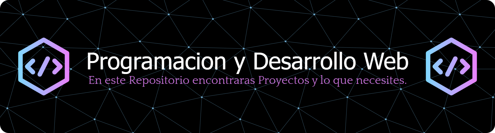

# Bienvenidos al GitHub de JmmA Coders

Comunidad dedicada a aprender compartir conocimientos  en programacion y tegnologia. Estamos aqui para aprender juntos y compartir experiencias, resolver problemas juntos y ayudar a cada miembro para que alcance sus metas.

### Skills

	
    	
        
        
        
        
        
        
        
        
        
        
        
        
        	

        